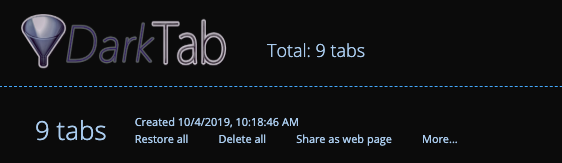

# DarkTab

Like OneTab, but darker.

## What

OneTab, but with a dark theme and without analytics.

## Why

I suspect OneTab will get a dark theme one day, but I'd rather not wait. As the last holdout against the rising tide of darkness OneTab had to go.

## Installation

- Download this source code using GitHub download link above
- In Chrome, open <chrome://extensions/>
- Check the toggle to enable "Developer Mode" (should be in the upper-right corner)
- Drag the folder containing this source code onto the extensions window. Chrome will install it.
